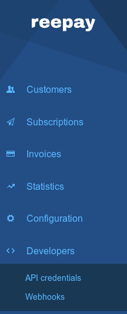
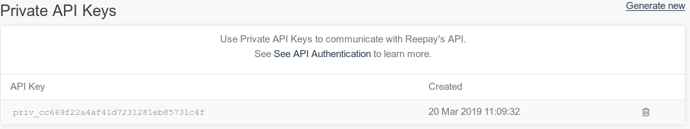
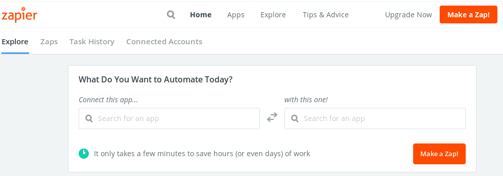
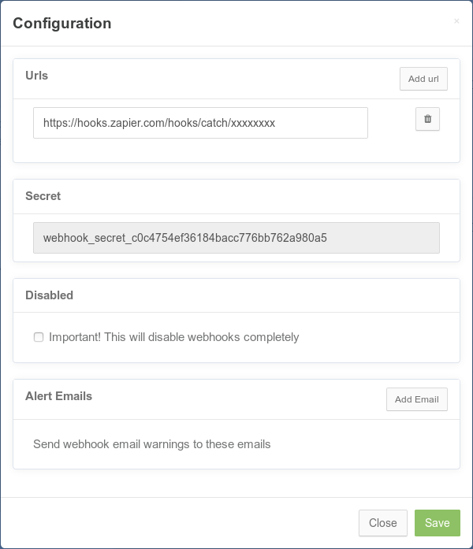

# Reepay-zap

This is a [Zapier](https://zapier.com/) application made for [Reepay](https://reepay.com/).

The purpose of the application is giving their users point and click gui for automation, so they can tedius task easily.

## Usage

This is a little guide on how to use the application, there is an important disclaimer at the bottom we recommend you start by reading.

### Reepay setup

First of all you need to be signed up on Reepay, and have a account. Then you need to select the account you want to setup a Zapier on.

click on 'API credentials'

Here you should see 2 types of keys, a public and a private key. What we are interrested in is the private type.

You should be able to see a clickable text called 'Generate new', click this. You should now be presented with something like this

This should make you a API key, you should save this for the time being, but keep it private since it can give access to you customer data. 

### Zapier setup

First of all you need to be signed up on Zapier. Depending on how big and advanced you want your Zapier automation to be you will need different tier of subscriptions. We recommend you to have the 'Professional' plan to make the best automation usage of this Zap. The reasoning behind this is the need for 'Conditional Logic'.

You need to make a new zap which you can do by clicking on 'Make a Zap!'

You are now supposed choose a Trigger App, for this we recommend to use Zapiers webhook app.

Here you get asked to 'Select Webhooks by Zapier Trigger'. You need to select 'Catch Hook'. At the next step you dont need to do anything, just click 'Continue' here. At the last step you will be provided with a URL that seems a bit like this 'https://hooks.zapier.com/hooks/catch/xxxxxxxx'. You will need to save this URL for now and head into Reepay in a new fan.

As shown above when going into the API credentials, we just need to go into the Webhooks now.

You should now see this on the top of the new page

You should now click on 'Configuration', it will open a popup. Here you should click on 'Add url'. This will create a textbox field where you can put your URL you got before, so it should look like this.

Now go back to Zapier, here you should now click on 'Ok, i did this', this will make it wait for a trigger from Reepay so it knows what kind of data it gets. Either wait on getting a trigger, or provoke it yourself.

Next thing you need to do is to add the Reepay zapier application.

SELECT ACTION HERE WRITE THIS HERE

Now you will be presented with a screen wherethere is a button called 'Connect an Account'. This will open a popup window where it ask permission to access your Reepay Account. Now its time to dig the API key from earlier back up, and put it in the API Key field and click 'Yes, Continue'. 

WRITE MORE HERE WHEN THERE IS MORE INFORMATION AVAIBLE

## DISCLAIMER

IF YOU BY ANY CHANCE GET YOUR PRIVATE KEY LEAKED WE RECOMMEND YOU TO DELETE IT AND GENERATE A NEW ONE. 

DELETION OF A KEY CAN BE DONE BY PRESSING THE TRASHCAN ICON NEXT TO KEY. YOU THEN NEED TO REPLACE ALL THE PLACES YOU USE YOUR PRIVATE KEY SO THEY CAN FUNCTION AGAIN!

WE ARE NOT RESPONSIBLE FOR YOU NOT HANDLING YOUR API KEY SAFELY AND CANNOT BE HELD LIABLE FOR ANY LOSES OF ANY KIND.